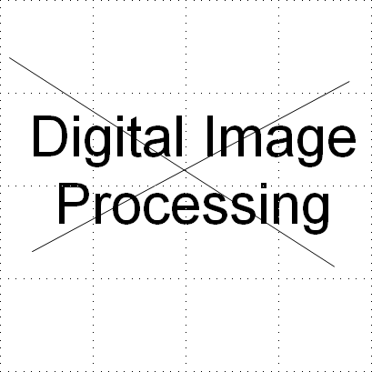

# Morphological-image-Processing-and-Image-segmentation
This repository could be divided into two sections. 
## Morphological Image Processing
Here, an image shown below namely Noisy image, is taken and morphological image processing technqiues are used without the use of inbuilt MATLAB functions to get rid of the noisy lines. Furthermore, all the characters that are not tall are removed i.e. only D, P, I and l are kept in the figure. The results can be seen in Project5Report_PavanGurudath.pdf

